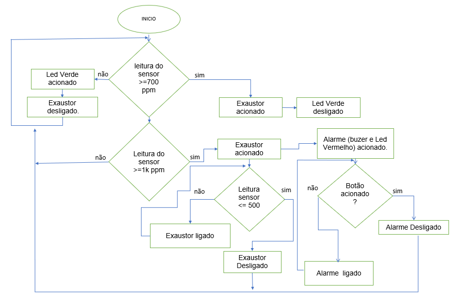

Detector de Gás Inteligente
Projeto desenvolvido pela Equipe InnovaTech para monitoramento de concentração de gás em ambientes, acionando exaustor e alarme via Arduino.

✨ Descrição
Este sistema utiliza um sensor de gás MQ-6 para detectar a presença de gases inflamáveis (como GLP e butano) e aciona automaticamente um exaustor e/ou um alarme sonoro e visual caso o nível de gás exceda limites pré-definidos. Um botão permite o desligamento manual do alarme.

🚦 Fluxograma

🚀 Funcionalidades
Monitoramento contínuo da concentração de gás.
Acionamento automático de exaustor (ventilador) acima de 700 ppm.
Acionamento automático de alarme (LED e buzzer) acima de 1000 ppm.
LED verde indica ambiente seguro.
Botão físico para desligar o alarme.
Exibição dos dados em tempo real no monitor serial.

⚙️ Esquema de Hardware
Sensor de Gás MQ-6: Entrada analógica (A0)
LED Vermelho: Pino 7
LED Verde: Pino 6
Buzzer: Pino 9
Exaustor/Ventilador: Pino 8
Botão de Reset do Alarme: Pino 2 (com pull-up interno)
Arduino: Pode ser UNO, Nano, Mega, etc.

🛠️ Como funciona
O sensor MQ-6 lê a concentração de gás.
Se o valor ultrapassar 700 ppm, o exaustor é ligado.
Se ultrapassar 1000 ppm, o alarme (LED e buzzer) começa a piscar e soar.
O usuário pode desligar o alarme pressionando o botão.
Os valores de concentração são exibidos no monitor serial para acompanhamento.

📄 Trecho do Código
C++
const int LED = 7;        // LED vermelho de alerta
const int BUZZER = 9;     // Buzzer de alarme
const int EXAUSTOR = 8;   // Ventilador/Exaustor
const int BUTTON = 2;     // Botão para desligar alarme
const int MQ6_PIN = A0;   // Sensor MQ-6
const int GREEN_LED = 6;  // LED verde

// ... restante do código ...

📦 Instalação
Monte os componentes conforme o esquema acima.
Faça o upload do código para o Arduino usando a IDE Arduino.
Abra o monitor serial (baudrate 9600) para visualizar os dados.

📝 Licença
Este projeto é de uso livre para fins educacionais. Sinta-se à vontade para adaptar conforme a sua necessidade!
